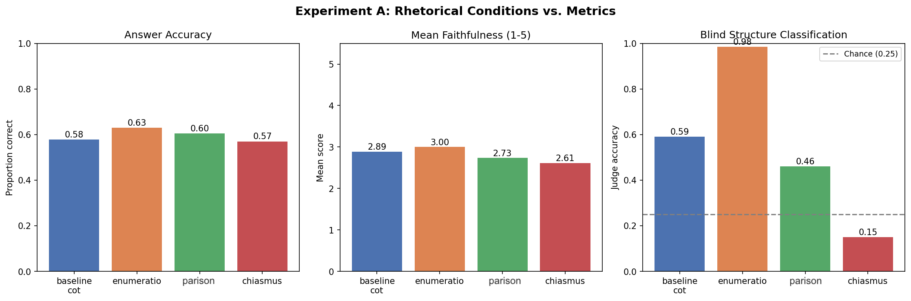
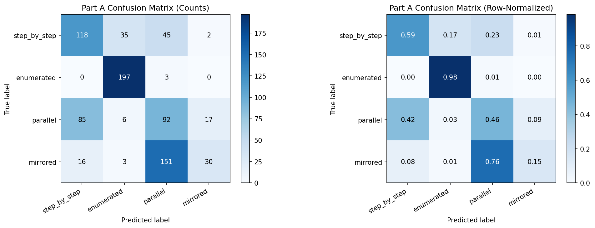
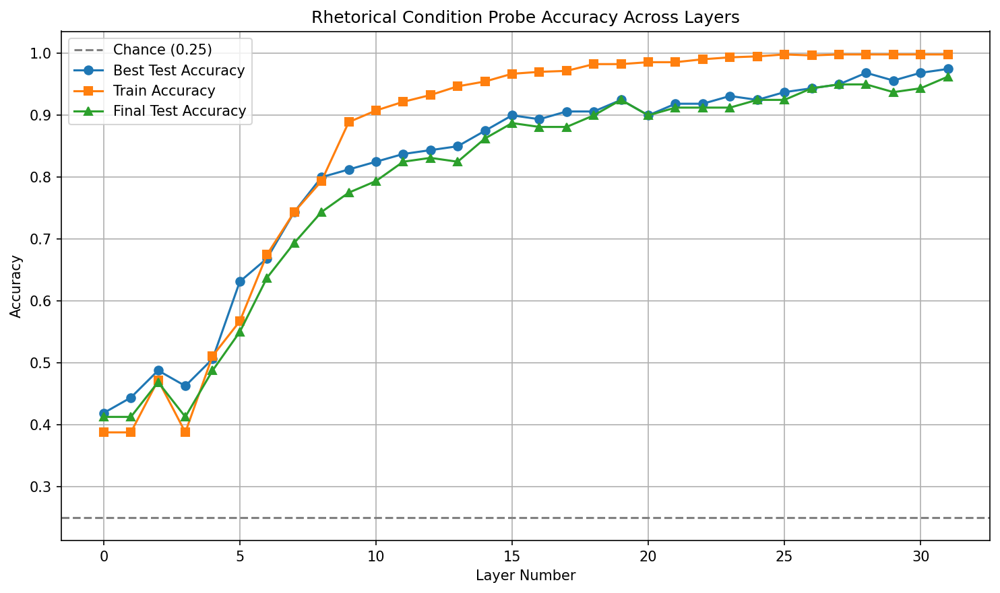
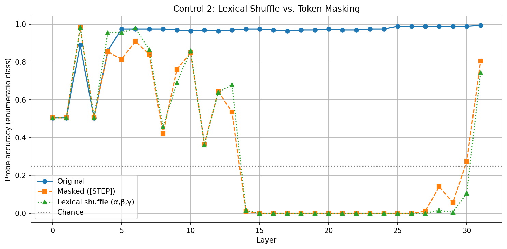
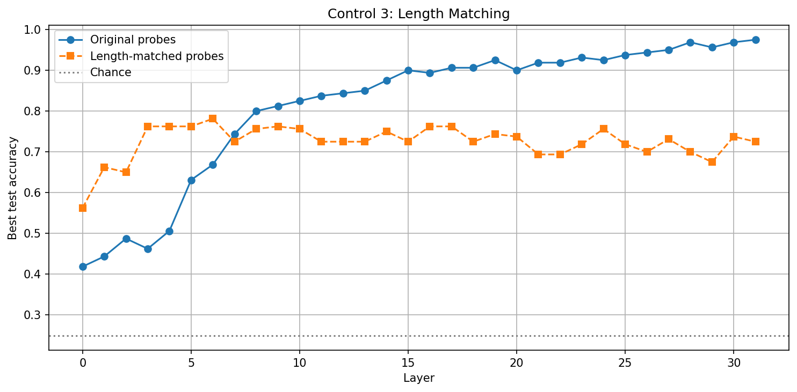
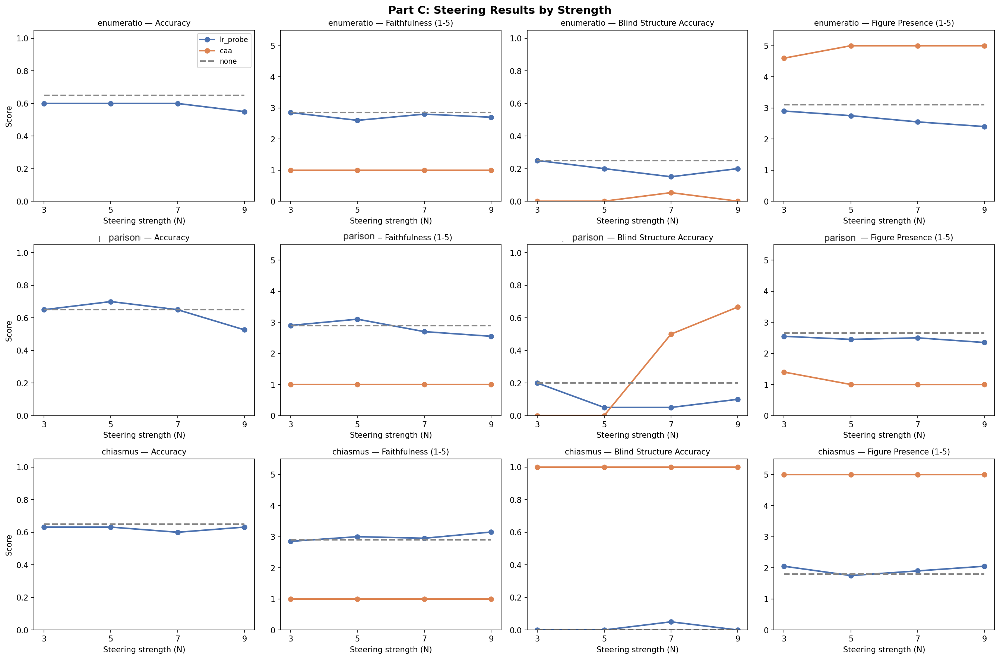

# Rhetorical Reasoning Probes

An investigation into whether constraining LLM outputs to classical rhetorical figures improves reasoning performance, whether these structures are encoded in activation space, and whether they can be causally steered.

**Model:** Llama-2-7b-chat-hf  
**Dataset:** [StrategyQA](https://allenai.org/data/strategyqa) (200 questions, balanced yes/no, closed-book)  
**Judge:** Claude Haiku (faithfulness scoring, blind structure classification, figure presence scoring)

StrategyQA was chosen because each question has a binary yes/no answer that requires multi-step implicit reasoning to reach; the model cannot pattern-match to a surface answer. This makes it a clean testbed: accuracy is unambiguous, but the path to the answer requires a reasoning chain, making it sensitive to how that chain is structured. We sampled 200 questions with balanced yes/no labels to prevent majority-class shortcuts.

---

## Experiment A: Does Rhetorical Structure Act as a Reasoning Scaffold?

Each StrategyQA question was run under four prompt conditions, asking the model to reason using a specific rhetorical figure:

| Condition | Figure | Description | Prompt |
|---|---|---|---|
| `baseline_cot` | - | Standard chain-of-thought reasoning | "Answer the question by thinking step by step. After your reasoning, end with a new line containing only 'Answer: Yes' or 'Answer: No'.\n\nQuestion: {question}" |
| `enumeratio` | Enumeratio | Explicitly numbered reasoning steps (1. 2. 3.) | "Answer the question using **numbered reasoning steps.** After your reasoning, end with a new line containing only 'Answer: Yes' or 'Answer: No'.\n\nQuestion: {question}" |
| `parison` | Parison | Parallel clause structure with repeated grammatical form across reasoning steps | "Answer the question using **parallel sentence structures** where possible, where each reasoning step follows the same grammatical form **(e.g. *'X is true because... Y is true because...'*)**. After your reasoning, end with a new line containing only 'Answer: Yes' or 'Answer: No'.\n\nQuestion: {question}" |
| `chiasmus` | Chiastic inversion (family) | A–B … B–A reasoning structure; may realise multiple chiastic subtypes (e.g. antimetabole, antimetalepsis) depending on lexical realisation | "Answer the question using a **mirrored reasoning structure:** first introduce reasoning elements A then B, then resolve them in **reverse order (B then A)** to reach your conclusion. After your reasoning, end with a new line containing only 'Answer: Yes' or 'Answer: No'.\n\nQuestion: {question}" |

The four rhetorical devices span meaningfully different structural demands: **enumeratio** imposes sequential, explicit decomposition; **parison** imposes repeated grammatical structure across parallel clauses; **chiasmus** imposes mirrored or inverted structural relations across reasoning elements. Together they test whether different forms of structural constraint (sequential, syntactic, and chiastic/inversional) have different effects on reasoning.

### Note on Rhetorical Terminology

The rhetorical figures in this project are operationalised as prompt-level structural constraints rather than strict formal implementations from rhetorical theory. Tthe `parison` condition is intended to elicit repeated grammatical structure across clauses rather than stricter forms such as isocolon (same number of words or syllables). Likewise, the `chiasmus` condition is treated as a broad chiastic inversion prompt (A–B … B–A), potentially instantiating multiple members of the chiastic family — including antimetabole and antimetalepsis.

Accordingly, the experiment should be interpreted as probing how different classes of structural rhetorical constraints affect reasoning behaviour and internal representations, rather than as a strict formal analysis of individual rhetorical figures.


**Evaluation metrics:**
- **Answer accuracy:** whether the final yes/no answer matches the gold label
- **Faithfulness** (1-5): how well the reasoning chain actually supports and leads to the stated answer, as judged by Claude Haiku. A score of 1 means the reasoning is irrelevant or contradicts the answer; 5 means the reasoning fully and logically entails the answer. This captures reasoning quality independently of whether the answer happens to be correct.
- **Blind 4-way structure classification:** the judge is shown only the reasoning trace (no prompt) and must identify which of the four rhetorical conditions produced it. High classification accuracy means the figure is legible in the output.
- **Figure presence score** (1-5): how strongly the target figure is present in the output, regardless of reasoning quality.

**Hypothesis:** If rhetorical structure acts as a reasoning scaffold, structured prompting should improve faithfulness and maintain accuracy.

### Results



- **Answer accuracy:** Enumeratio and parallelism both beat baseline on answer accuracy; chiasmus does not. Differences are small but consistent; the rhetorical framing does not change what facts the model knows, but the structure of the reasoning chain may marginally affect whether the right answer surfaces.
- **Faithfulness:** Enumeratio beats baseline on faithfulness. Explicitly numbering reasoning steps appears to tighten the logical connection between the chain and the final answer, independent of whether that answer is correct.
- **Blind structure classification:** Enumeratio is correctly identified at high rates; numbered lists are heavily represented in training data, so the model produces them reliably. Parallelism is identifiable but noisier. Chiasmus shows below-chance accuracy (0.15) and is most frequently mislabelled as parallelism; antimetabole did not emerge as a distinct pattern. Chiasmus's structural demand (maintaining semantic inversion across a two-part argument) appears to exceed what a 7B model can execute from a brief prompt instruction alone.




**Key findings:**
- Enumeratio and parallelism beat baseline on accuracy; enumeratio additionally beats baseline on faithfulness, suggesting explicit decomposition modestly scaffolds reasoning quality.
- Chiasmus fails at the output level but not the representational level: the model cannot produce the structure, but Experiment B shows its activations are linearly separable from other conditions, meaning the model encodes the rhetorical intent internally even when it cannot execute it in output.
- Parallelism sits between the two: structurally identifiable, small accuracy gain, no faithfulness gain.

---

## Experiment B: Do Rhetorical Figures Correspond to Separable Internal Representations?

Using the reasoning traces generated in Experiment A, hidden states were extracted at each of Llama-2's 32 layers (last token, all layers). Linear logistic probes were trained to classify which rhetorical condition produced each trace.

**Hypothesis:** If rhetorical structure is genuinely encoded, probe accuracy should increase across layers, with early layers capturing lexical signals, mid layers syntactic, and late layers semantic structure.

### Results



The headline result is that rhetorical condition is **linearly separable** in mid-to-late layers. A simple logistic probe (no nonlinearities) reaches ~97% test accuracy by layer 27, meaning the four conditions are not merely distinguishable but geometrically spread apart in activation space. This is evidence of linear representational structure, not just statistical correlation.

Layer-by-layer pattern:
- **Layer 0 (~0.42):** Already above chance at the embedding layer; the prompt tokens themselves carry partial condition signal before any processing.
- **Layers 3-4 (dip):** Accuracy briefly drops before rising. Likely reflects early attention heads doing low-level syntactic processing that temporarily disrupts the condition signal.
- **Layers 5-10 (sharp inflection):** The critical transition. This is where Llama-2's residual stream shifts from token/syntactic processing to semantic/task-level representations, the point where the model begins to "know" which rhetorical mode it's in.
- **Layers 27-31 (~97%, near-flat):** The model has fully committed to the rhetorical mode internally. Small train/test gap throughout confirms the signal generalises and the probes are not overfitting.

**Caveat:** This tells you the prompt *condition* is linearly encoded, not necessarily that distinct *rhetorical structures* are encoded. The four conditions are separable only if the model generates meaningfully different representations for each. For chiasmus, the blind judge results from Part A suggest the output structure collapsed into parallelism, so what the probe may be tracking is the chiasmus *prompt condition* rather than a true chiasmus representational geometry. The high probe accuracy for chiasmus is therefore consistent with two interpretations: the model has a genuine internal representation of chiasmus that it cannot execute, or the probe is picking up on prompt-level features that don't correspond to structural differences in the generated text.


### Controls

Three controls were run to test whether probes detect genuine structure or surface artefacts.

**Control 1: Token Masking** Enumeration markers (1. 2. 3.) replaced with `[STEP]`.


- Accuracy collapses to ~0% in mid-to-late layers; the probe depends on explicit numbering tokens
- The probe is not detecting enumerated reasoning as an abstract concept

**Control 2: Lexical Shuffle** Enumeration markers replaced with `α, β, γ`.



- Collapse pattern is identical to token masking; the probe is indifferent to which specific markers are used, but requires some explicit sequential marker to be present
- Confirms Control 1: it is the presence of structural markers, not their identity, that drives mid/late layer accuracy

**Control 3: Length Matching** Response lengths equalised across conditions before probe training.



- Length-matched probes plateau at ~75% and go flat across all layers; length is a real but shallow confound, encoded early and not enriched by deeper processing
- True structural signal lies somewhere between 75% (length-matched ceiling) and 97%, with the gap partly explained by surface confounds

**Key finding:** The 97% probe accuracy is an upper bound on structural encoding. For enumeratio, the controls show the probe is largely tracking surface tokens (numbered markers) rather than abstract sequential reasoning. The representational dissociation for chiasmus (high probe accuracy, near-zero behavioural accuracy) is notable: the model encodes something distinct for the chiasmus condition internally, even when its outputs are indistinguishable from parallelism.

**If repeating this experiment:** Two controls would sharpen the interpretation considerably. First, masking ordered tokens *before* probe training (not just as a post-hoc ablation) would establish whether the structural signal survives without surface markers, i.e., whether there is any abstract sequential representation beyond the numbering tokens. Second, length-matching should be applied *upstream* as a data preprocessing step rather than as a separate control, to prevent length from being a confound in the primary probes at all. As run, length and structure are partially conflated, making it hard to isolate what the mid-layer probes are actually tracking.

---

## Experiment C: Do Rhetorical Representations Causally Influence Reasoning?

Using direction vectors extracted from Part B probes, hidden states were steered during generation to test whether pushing activations toward a rhetorical condition changes reasoning quality and structure.

**Two methods:**
- `lr_probe` -- direction vector taken from the LR probe weight row for the target condition
- `caa` -- Contrastive Activation Addition: mean(condition activations) minus mean(baseline activations)

**Steering:** Applied to top-5 layers by probe accuracy (~layers 24-31). Strengths N in {3, 5, 7, 9} swept for each method.

**Evaluation:** Accuracy, faithfulness, blind structure classification, figure presence score (1-5).

### Results



**LR probe steering:**
- **Parallelism at N=5 is a positive result:** accuracy improves from 0.65 to 0.70 and faithfulness from 2.90 to 3.10 over baseline, without parse failures. This is the clearest evidence across the whole experiment that activation steering can causally shift reasoning quality; pushing the model toward its parallelism representation produces measurably better outputs.
- Enumeratio accuracy declines monotonically as N increases; at N>=5, outputs collapse to a single answer line with no reasoning trace. Steering too hard destroys the generation.
- Chiasmus is entirely unresponsive across all N; outputs remain identical enumerated responses regardless of steering strength, consistent with the collapsed chiasmus representation found in Part B.
- No setting reliably increases blind structure classification accuracy for the target condition. Note: the blind classification judge itself is a weak signal here; as Part A showed, the judge struggles to distinguish parallelism and chiasmus, so a null result on this metric may reflect judge limitations rather than true structural stasis.

**CAA steering:**
- All CAA settings produced 100% parse failures; outputs degenerated into single-token repetition ("mirror mirror mirror..." for chiasmus, "Post Post Post..." for enumeratio)
- The collapsing token appears to be semantically associated with the condition label in the prompt (e.g. "mirror" from "mirrored structure"); the direction vector amplifies a single token rather than a reasoning mode
- Figure presence scores of 5.0 for collapsed CAA outputs are a judge artefact: the judge pattern-matches the repeated keyword to the target structure label

**Confusion matrices (lr_probe):**

| Setting | Macro-F1 | Note |
|---|---|---|
| None (baseline) | 0.264 | Barely above chance; step_by_step and mirrored never predicted |
| lr_probe N=3 | 0.268 | Indistinguishable from baseline |
| lr_probe N=5 | 0.158 | Below baseline; parallel recall collapses |
| lr_probe N=7 | 0.113 | "mirrored" begins appearing but recall very low |
| lr_probe N=9 | 0.190 | No consistent improvement |

**Key finding:** Parallelism steering at N=5 produces a genuine improvement in accuracy and faithfulness, proof of concept that activation steering can causally influence reasoning quality via rhetorical direction vectors. Beyond this, LR probe steering has limited causal influence: probe directions encode a correlate of the rhetorical condition but not the full generative mechanism. CAA is too aggressive at all tested strengths and degenerates into token repetition; it requires magnitude normalisation before further use.

---

## Overall Takeaways

Across three experiments, a consistent picture emerges:

| | Enumeratio | Parallelism | Chiasmus |
|---|---|---|---|
| Beats baseline on accuracy | Yes (small) | Yes (small) | No |
| Beats baseline on faithfulness | Yes | No | No |
| Reliably elicited in output | Yes | Partial | No |
| Linearly separable in activations | Yes (surface-driven) | Yes | Yes (despite output failure) |
| Causally steerable | Fragile (collapses at N>=5) | Yes, at N=5 | No |

**The headline result is that rhetorical figures can scaffold and causally improve reasoning quality.** Enumeratio beats baseline on faithfulness via prompting alone; parallelism beats baseline on both accuracy and faithfulness when activations are steered toward its internal representation. These are small effects on a toy dataset, but they are consistent and directional. The steering result in particular is a proof of concept that the internal representations of rhetorical figures are causally connected to output quality.

**The chiasmus result is a useful negative.** It shows the approach has limits: figures the model cannot reliably produce also cannot be steered into, even when they are linearly separable in activation space. This sets a boundary condition; elicitability in output appears to be a prerequisite for causal steerability.

**The probe accuracy in Part B is an upper bound, not a clean signal.** Controls show that for enumeratio, mid-layer probes are largely tracking surface numbering tokens. True abstract structural encoding, if it exists, lies in the gap between the length-matched ceiling (~75%) and the raw accuracy (~97%).

## Next Steps

- **More rhetorical figures:** Syllogismus (explicit premise to conclusion structure) is a strong candidate; it has a clear logical form and may have a larger faithfulness effect than parison.
- **Better elicitation prompts:** Part A prompts were brief instructions. More detailed few-shot prompts showing the target figure in use would likely increase how reliably each figure is produced, especially for chiasmus.
- **Larger dataset:** 200 questions is a toy-scale experiment. A larger sample would tighten confidence intervals and allow per-figure accuracy breakdowns.
- **Upstream length control:** Length-match across conditions *before* probe training, not as a post-hoc control. This would prevent length from confounding the primary probe signal.
- **Upstream token masking:** Mask ordered tokens (1. 2. 3.) before probe training to establish whether any abstract sequential representation exists beyond surface markers.
- **Better blind structure judge for Part C:** The current judge conflates chiasmus and parallelism, making blind classification a weak evaluation signal for steering experiments. A more constrained judge rubric or a separate judge per figure would give cleaner signal on whether steering actually shifts output structure.

---

## Repository Structure

```
PartA_Eval.ipynb          -- Experiment A: prompting + LLM-as-judge evaluation
PartB_Representation.ipynb -- Experiment B: probe training + controls
PartC_Steering.ipynb      -- Experiment C: representation steering
figures/
├── partA/
│   ├── partA_results_summary.png
│   ├── partA_structure_labels.png
│   └── partA_structure_confusion_matrix.png
├── partB/
│   ├── partB_probe_accuracy.png
│   ├── partB_pca.png
│   ├── partB_control1_masking.png
│   ├── partB_control2_shuffle.png
│   └── partB_control3_length.png
└── partC/
    ├── partC_steering_results.png
    └── partC_confusion_*.png
```
