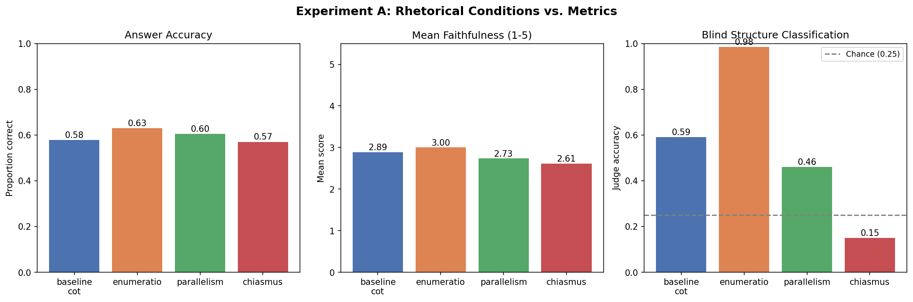
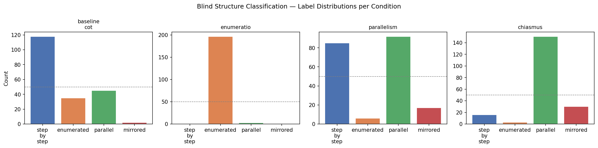
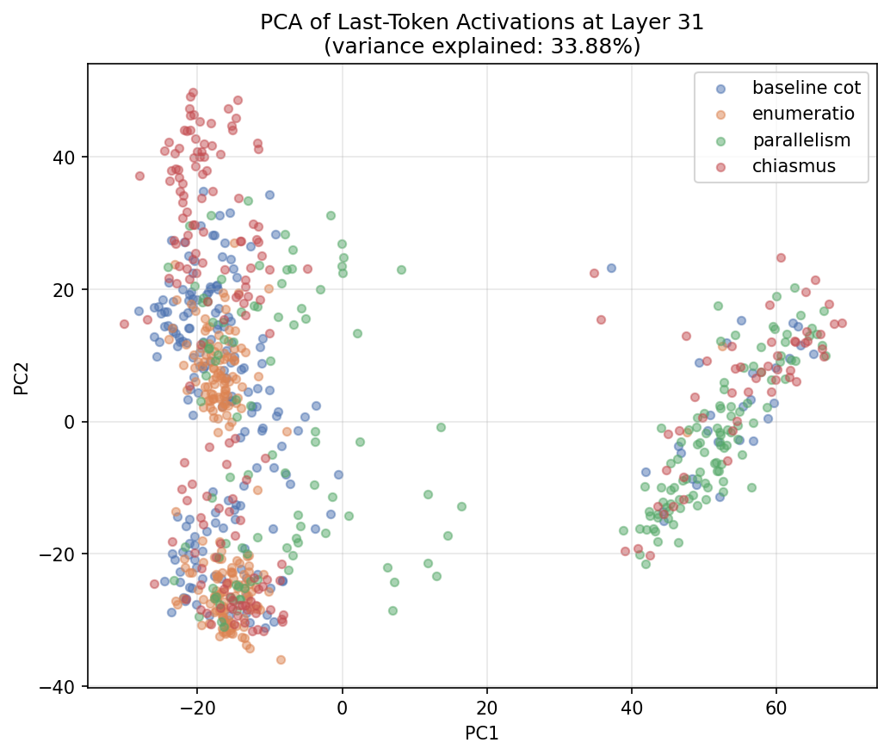
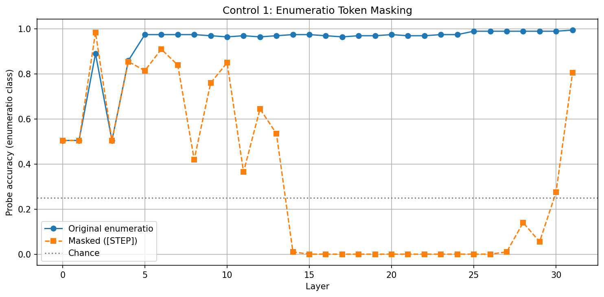
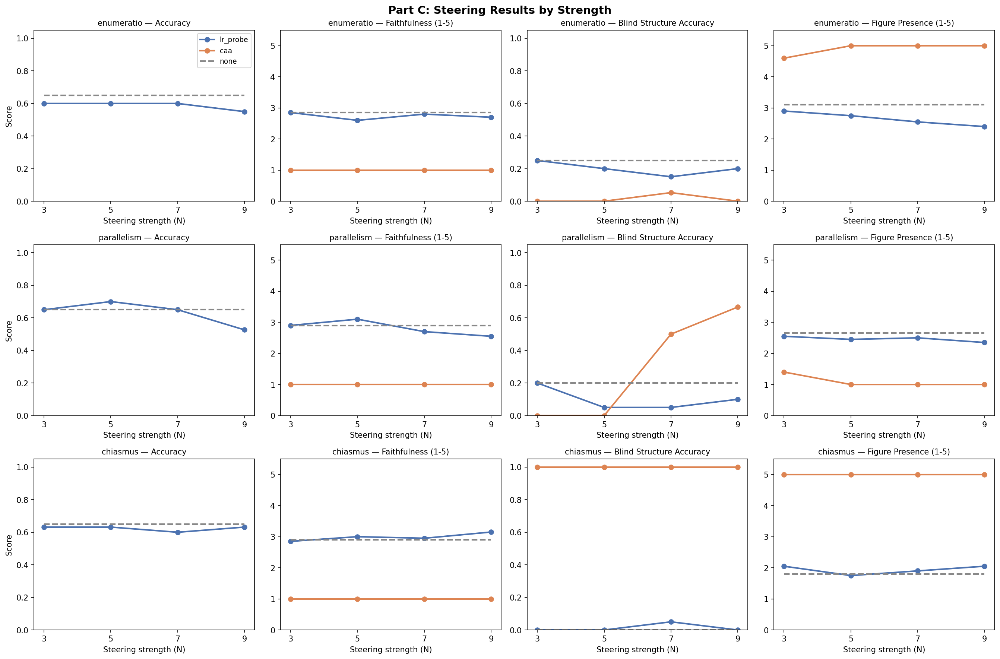

# Rhetorical Reasoning Probes

An investigation into whether constraining LLM outputs to classical rhetorical figures improves reasoning performance, whether these structures are encoded in activation space, and whether they can be causally steered.

**Model:** Llama-2-7b-chat-hf  
**Dataset:** StrategyQA (200 questions, balanced yes/no, closed-book)  
**Judge:** Claude Haiku (faithfulness scoring, blind structure classification, figure presence scoring)

---

## Experiment A: Does Rhetorical Structure Act as a Reasoning Scaffold?

Each StrategyQA question was run under four prompt conditions, asking the model to reason using a specific rhetorical figure:

| Condition | Figure | Description |
|---|---|---|
| `baseline_cot` | — | Standard chain-of-thought |
| `enumeratio` | Enumeratio | Explicitly numbered steps (1. 2. 3.) |
| `parallelism` | Parison | Parallel phrases of equal grammatical structure |
| `chiasmus` | Chiasmus | Mirrored/inverted structure (A-B...B-A) |

**Evaluation:** Answer accuracy, faithfulness (1–5, LLM judge), blind 4-way structure classification, figure presence score.

**Hypothesis:** If rhetorical structure acts as a reasoning scaffold, structured prompting should improve faithfulness and maintain accuracy.

### Results



- No condition consistently outperformed baseline on accuracy or faithfulness
- Enumeratio produced the most structurally consistent outputs (judge correctly classified it most often)
- Chiasmus showed below-chance blind structure classification accuracy (0.15), and was most frequently mislabelled as parallelism




**Key finding:** Chiasmus could not be reliably elicited from a 7B model — outputs collapsed into parallelism-like structure. This is a behavioural failure but, as Experiment B shows, not a representational one.

---

## Experiment B: Do Rhetorical Figures Correspond to Separable Internal Representations?

Using the reasoning traces generated in Experiment A, hidden states were extracted at each of Llama-2's 32 layers (last token, all layers). Linear logistic probes were trained to classify which rhetorical condition produced each trace.

**Hypothesis:** If rhetorical structure is genuinely encoded, probe accuracy should increase across layers — early layers capturing lexical signals, mid layers syntactic, late layers semantic structure.

### Results


- Probes reach ~97% test accuracy by layer 27, far above 25% chance
- Signal emerges sharply at layers 5–10 and plateaus in late layers
- Small train/test gap confirms the signal generalises and is not overfitting
- Chiasmus is linearly separable in activation space despite failing at the output level — the model encodes the rhetorical intent even when it cannot produce it



### Controls

Three controls were run to test whether probes detect genuine structure or surface artefacts.

**Control 1 — Token Masking:** Enumeration markers (1. 2. 3.) replaced with `[STEP]`.



- Accuracy collapses to ~0% in mid-to-late layers — the probe depends on explicit numbering tokens
- The probe is not detecting enumerated reasoning as an abstract concept

**Control 2 — Lexical Shuffle:** Enumeration markers replaced with `α, β, γ`.


- Collapse pattern is identical to token masking — the probe is indifferent to which specific markers are used, but requires some explicit sequential marker to be present
- Confirms Control 1: it is the presence of structural markers, not their identity, that drives mid/late layer accuracy

**Control 3 — Length Matching:** Response lengths equalised across conditions before probe training.


- Length-matched probes plateau at ~75% and go flat across all layers — length is a real but shallow confound, encoded early and not enriched by deeper processing
- True structural signal lies somewhere between 75% (length-matched ceiling) and 97%, with the gap partly explained by surface confounds

**Key finding:** High probe accuracy is an upper bound. For enumeratio specifically, the probe is largely tracking surface tokens rather than deep structural encoding. The representational dissociation for chiasmus (high probe accuracy, low behavioural accuracy) suggests the model encodes prompt condition internally even when it fails to execute it in output.

---

## Experiment C: Do Rhetorical Representations Causally Influence Reasoning?

Using direction vectors extracted from Part B probes, hidden states were steered during generation to test whether pushing activations toward a rhetorical condition changes reasoning quality and structure.

**Two methods:**
- `lr_probe` — direction vector taken from the LR probe weight row for the target condition
- `caa` — Contrastive Activation Addition: mean(condition activations) − mean(baseline activations)

**Steering:** Applied to top-5 layers by probe accuracy (~layers 24–31). Strengths N ∈ {3, 5, 7, 9} swept for each method.

**Evaluation:** Accuracy, faithfulness, blind structure classification, figure presence score (1–5).

### Results



**LR probe steering:**
- Parallelism at N=5 is the only setting showing improvement over baseline (accuracy 0.70 vs 0.65, faithfulness 3.10 vs 2.90) without parse failures
- Enumeratio accuracy declines monotonically as N increases — at N≥5, outputs collapse to a single answer line with no reasoning trace
- Chiasmus is entirely unresponsive across all N — outputs remain identical enumerated responses regardless of steering strength, consistent with the collapsed chiasmus representation found in Part B
- No setting reliably increases blind structure classification accuracy for the target condition

**CAA steering:**
- All CAA settings produced 100% parse failures — outputs degenerated into single-token repetition ("mirror mirror mirror..." for chiasmus, "Post Post Post..." for enumeratio)
- The collapsing token appears to be semantically associated with the condition label in the prompt (e.g. "mirror" from "mirrored structure") — the direction vector amplifies a single token rather than a reasoning mode
- Figure presence scores of 5.0 for collapsed CAA outputs are a judge artefact: the judge pattern-matches the repeated keyword to the target structure label

**Confusion matrices (lr_probe):**

| Setting | Macro-F1 | Note |
|---|---|---|
| None (baseline) | 0.264 | Barely above chance; step_by_step and mirrored never predicted |
| lr_probe N=3 | 0.268 | Indistinguishable from baseline |
| lr_probe N=5 | 0.158 | Below baseline; parallel recall collapses |
| lr_probe N=7 | 0.113 | "mirrored" begins appearing but recall very low |
| lr_probe N=9 | 0.190 | No consistent improvement |

**Key finding:** LR probe steering has minimal causal influence on rhetorical structure in outputs. The probe directions encode a correlate of the rhetorical condition in activation space, but not the generative mechanism sufficient to produce that structure. CAA is too aggressive at all tested strengths and requires normalisation before further use.

---

## Repository Structure

```
PartA_Eval.ipynb          — Experiment A: prompting + LLM-as-judge evaluation
PartB_Representation.ipynb — Experiment B: probe training + controls
PartC_Steering.ipynb      — Experiment C: representation steering
partA_results_summary.png
partA_structure_confusion_matrix.png
partA_structure_labels.png
partB_probe_accuracy.png
partB_pca.png
partB_control1_masking.png
partB_control2_shuffle.png
partB_control3_length.png
partC_steering_results.png
partC_confusion_*.png
```
